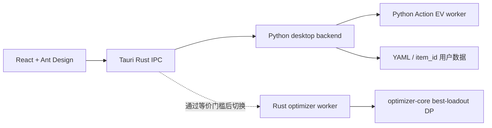

# Tauri / Rust 渐进迁移状态

## 当前边界



- PySide6 仍是默认完整应用；Tauri 是迁移中的内部桌面端。
- Python sidecar 是当前数据语义唯一来源，负责文件锁、revision、装备事务、作业管理和诊断导出。
- Rust `optimizer-core` 已实现预评分向量上的 exact best-loadout DP，包括套装要求、候选套装、锁定槽位和不可成型回退。
- Rust `optimizer-worker` 的 `best-loadout` 能力已标记 ready；完整 Action EV 明确标记为 not ready，不能设为生产默认。

## 等价与性能门槛

Python 参考实现生成 [rust_best_loadout_golden.json](../tests/fixtures/rust_best_loadout_golden.json)，Rust 单元测试直接消费同一文件。夹具覆盖：

- 4+2 质量取舍；
- 2+2+2；
- 当前锁定位置；
- 数值并列时保持 Python 的输入顺序和 item_id 选择；
- 套装方案不可行时按现有语义回退；
- 严格套装要求不可行时返回空。

固定 H=2 门槛：

```powershell
python scripts/benchmark_action_ev.py --threshold 60 --timeout 150
```

提交的性能夹具来自叶瞬光真实盘面，包含 6 件当前装备和 33 件背包候选；夹具不包含 item_id，并携带仅供 benchmark 临时加载的目标模板，不会成为产品内置模板。2026-07-11 最终本机基线为冷启动 32.36 秒、热缓存 0.92 秒。冷启动阶段主要耗时：

- `inventory.expected_action_value`: 28.71 秒；
- `inventory.lookahead_value`: 28.53 秒（包含在上层阶段中）；
- `inventory.static_expected_action_value`: 26.59 秒（包含在上层阶段中）；
- `best_combo.cached_total`: 17.88 秒。

本基准执行 91,551 次 best-loadout 查询，其中 69,187 次命中缓存、22,364 次实际计算。报告写入忽略跟踪的 `reports/h2_benchmark.json`。

## 离线打包

```powershell
.\scripts\build_tauri_windows.ps1 -SidecarsOnly
.\scripts\build_tauri_windows.ps1 -NoBundle
.\scripts\build_tauri_windows.ps1
```

打包脚本分别生成 `gear-optimizer-backend.exe` 和 `gear-optimizer-action-worker.exe`，先验证协议 schema、worker 导入和隔离目录下的 `workspace.get`，再把它们与 `assets`、`configs`、`examples` 一并映射到 Tauri 资源目录。冻结态 backend 通过 `GEAR_OPTIMIZER_ACTION_WORKER` 启动独立 worker，避免错误地用 backend 自身执行 `python -m`。

Windows NSIS 使用 `offlineInstaller` 内嵌 WebView2 runtime。安装包因此增加约 127MB，但没有预装 WebView2 的机器也不需要联网下载运行时。

2026-07-11 本机工具链已经闭环：Visual Studio Build Tools 17.14.35、MSVC 14.44.35207、Windows SDK 10.0.26100、Rust stable MSVC 1.97.0、Node.js 24.18.0 和 pnpm 11.7.0。GNU Rust 工具链仍保留为备用，默认 target 为 `x86_64-pc-windows-msvc`。

同日使用隔离 `user_data` 完成原生 Tauri 验收：

- 游戏和代理人使用普通下拉；切换代理人时绝区零全局库存始终为 45 件。
- 叶瞬光与星徽·比利各自保持 6/6 装备和独立目标模板；装备、卸下只修改 item_id 引用，库存总数不变。
- H=1 返回 14/14 行，界面总耗时约 6.1 秒；H=2 在约 9.7 秒、32.1% 时可取消且界面保持响应。
- 叶瞬光 H=2 返回 28/28 行，界面总耗时 34.1 秒，算法阶段 31.98 秒；91,551 次 best-loadout 查询的缓存命中率为 75.5%。
- 阶段耗时图、action 热力图和 JSONL 日志正常；诊断 ZIP 为 15 个条目、约 65.6KB。
- 1440×900 默认窗口和 1100×700 最小窗口均完成原生捕获检查，选择器、状态、表格和装备位没有重叠。
- `-NoBundle` 原生 EXE 与完整 NSIS 构建均通过。NSIS 安装包为 282.38MiB，其中内嵌 WebView2 offline installer 为 194.22MiB；隔离目录静默安装、启动和卸载均成功。

纯净 Windows 且未安装 WebView2 的虚拟机验证仍保留为 release gate。PySide6 继续是默认发布版本。

## 启用 Rust Action EV 的条件

1. Rust worker 能读取现有 Action EV schema v1，并输出相同的 rows、排序向量、概率和 performance audit。
2. Python/Rust 黄金测试覆盖 H=1、H=2、随机位置、固定位置和库存胚子语义。
3. 用户真实绝区零盘面冷/热运行均不超过 60 秒，且 Rust 相比 Python 有稳定收益。
4. 取消、进度、错误文件和诊断导出经过 Windows 打包烟测。

条件全部满足前，UI 不展示 Rust 为可选生产引擎。
