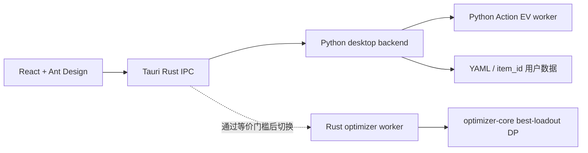

# Tauri / Rust 渐进迁移状态

## 当前边界



- PySide6 仍是默认完整应用；Tauri 是迁移中的内部桌面端。
- Python sidecar 是当前数据语义唯一来源，负责文件锁、revision、装备事务、作业管理和诊断导出。
- Rust `optimizer-core` 已实现预评分向量上的 exact best-loadout DP，包括套装要求、候选套装、锁定槽位和不可成型回退。
- Rust `optimizer-worker` 的 `best-loadout` 能力已标记 ready；完整 Action EV 明确标记为 not ready，不能设为生产默认。

## 等价与性能门槛

Python 参考实现生成 [rust_best_loadout_golden.json](../tests/fixtures/rust_best_loadout_golden.json)，Rust 单元测试直接消费同一文件。夹具覆盖：

- 4+2 质量取舍；
- 2+2+2；
- 当前锁定位置；
- 数值并列时保持 Python 的输入顺序和 item_id 选择；
- 套装方案不可行时按现有语义回退；
- 严格套装要求不可行时返回空。

固定 H=2 门槛：

```powershell
python scripts/benchmark_action_ev.py --threshold 60 --timeout 150
```

提交的性能夹具来自叶瞬光真实盘面，包含 6 件当前装备和 33 件背包候选；夹具不包含 item_id，并携带仅供 benchmark 临时加载的目标模板，不会成为产品内置模板。2026-07-11 本机基线为冷启动 35.85 秒、热缓存 0.98 秒。冷启动阶段主要耗时：

- `inventory.expected_action_value`: 31.88 秒；
- `inventory.lookahead_value`: 31.50 秒（包含在上层阶段中）；
- `inventory.static_expected_action_value`: 29.40 秒（包含在上层阶段中）；
- `best_combo.cached_total`: 20.52 秒。

本基准执行 91,551 次 best-loadout 查询，其中 69,187 次命中缓存、22,364 次实际计算。报告写入忽略跟踪的 `reports/h2_benchmark.json`。

## 离线打包

```powershell
.\scripts\build_tauri_windows.ps1 -SidecarsOnly
.\scripts\build_tauri_windows.ps1 -NoBundle
```

打包脚本分别生成 `gear-optimizer-backend.exe` 和 `gear-optimizer-action-worker.exe`，先验证协议 schema、worker 导入和隔离目录下的 `workspace.get`，再把它们与 `assets`、`configs`、`examples` 一并映射到 Tauri 资源目录。冻结态 backend 通过 `GEAR_OPTIMIZER_ACTION_WORKER` 启动独立 worker，避免错误地用 backend 自身执行 `python -m`。

本机已经完成两个 sidecar 的 one-file 构建和真实 H=1 烟测（14 行，约 2.67 秒）。当前机器没有完整 MinGW/MSVC Windows 链接工具，因此 Tauri CLI 在解析 bundle 配置并完成前端构建后停在系统 `dlltool`；GitHub `windows-latest` CI 负责完整原生编译。PySide6 继续是默认发布版本。

## 启用 Rust Action EV 的条件

1. Rust worker 能读取现有 Action EV schema v1，并输出相同的 rows、排序向量、概率和 performance audit。
2. Python/Rust 黄金测试覆盖 H=1、H=2、随机位置、固定位置和库存胚子语义。
3. 用户真实绝区零盘面冷/热运行均不超过 60 秒，且 Rust 相比 Python 有稳定收益。
4. 取消、进度、错误文件和诊断导出经过 Windows 打包烟测。

条件全部满足前，UI 不展示 Rust 为可选生产引擎。
